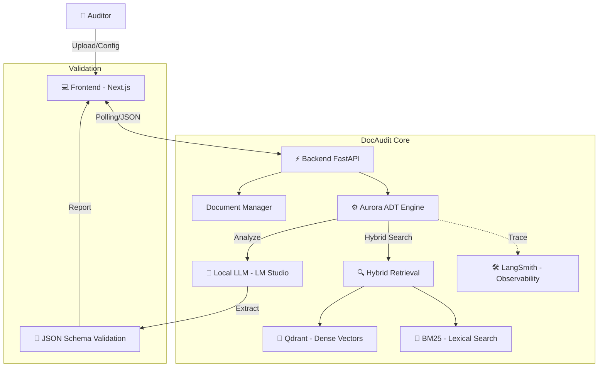

# 🕵️‍♂️ DocAudit Engine

**DocAudit Engine** é uma plataforma avançada de **Auditoria de Qualidade e Análise de Riscos** impulsionada por IA. Utilizando uma arquitetura RAG (Retrieval-Augmented Generation) híbrida, o sistema analisa contratos e documentos técnicos para detectar riscos, ambiguidades e conformidade com requisitos.

Diferente de chatbots genéricos, o DocAudit é focado em processamento estruturado (Aurora ADT Pipeline), permitindo varredura completa de documentos ("Scan All") para relatórios detalhados.

## ✨ Funcionalidades Principais

- 🔍 **Auditoria Automatizada**: Pipelines dedicados para:
  - **QA Requirements Audit**: Validação de requisitos técnicos.
  - **Risk Detection**: Identificação de riscos jurídicos, administrativos e operacionais.
  - **Ambiguity Detection**: Detecção de termos vagos ou mal definidos.
- 🚀 **Full Retrieval Scan**: Capacidade de processar o documento inteiro (chunk por chunk) garantindo 100% de cobertura na análise, sem depender apenas de busca por similaridade.
- 📊 **Relatórios Estruturados**: Geração de saídas em JSON estrito e visualização rica em dashboard interativo.
- 🧠 **Memória Híbrida**: Combinação de busca vetorial (**Qdrant**) e lexical (**BM25**) para precisão máxima.
- ⚡ **Frontend Moderno (Next.js)**: Interface reativa construída com React 19 e TailwindCSS.

## 🏗️ Arquitetura



## 🛠️ Tech Stack

### Frontend
- **Framework:** Next.js 16 (React 19)
- **Estilização:** TailwindCSS & Lucide React
- **UI Components:** Shadcn/ui (Radix UI)

### Backend
- **API:** FastAPI (Python 3.11+)
- **Vector DB:** Qdrant (Docker)
- **Core Logic:** LangChain + Aurora ADT (Custom Pipeline)
- **Busca:** Hybrid (Dense + BM25)

## 📋 Pré-requisitos

- **Python 3.11+**
- **Node.js 18+**
- **Docker** (para Qdrant)
- **LM Studio** (recomendado para LLM local)

## 🚀 Como Rodar

### 1. Preparar Banco de Dados
Certifique-se que o Docker está rodando e inicie o Qdrant:
```bash
docker start qdrant-rag
# OU se for a primeira vez:
# docker run -p 6333:6333 -p 6334:6334 qdrant/qdrant
```

### 2. Iniciar Backend
```bash
# Navegue até a raiz
python -m venv .venv
.\.venv\Scripts\Activate

# Instalar dependências
pip install -r requirements.txt

# Iniciar API
python -m uvicorn api:app --reload --host 0.0.0.0 --port 8000
```

### 3. Iniciar Frontend
⚠️ **Importante:** O frontend atual está na pasta `frontend` (Next.js), não use `frontend-new`.

```bash
cd frontend

# Instalar dependências
npm install

# Rodar servidor de desenvolvimento
npm run dev
```
O frontend estará acessível em: `http://localhost:3000`

## ⚙️ Configuração (.env)

Crie/edite o arquivo `.env` na raiz:

```env
# URL do modelo LLM (LM Studio ou OpenAI)
LM_STUDIO_URL=http://localhost:1234/v1

# Configuração Qdrant
QDRANT_URL=http://localhost:6333
QDRANT_COLLECTION=rag_collection

# Parâmetros de Análise
EMBEDDING_MODEL=all-MiniLM-L6-v2
```

## 📝 Primeiros Passos

1. Acesse `http://localhost:3000`.
2. Faça **Upload** de um contrato ou documento de requisitos (PDF).
3. Selecione o tipo de análise (ex: *Risk Detection*).
4. Marque **"Scan All Chunks"** para uma varredura completa.
5. Clique em **Executar Análise** e aguarde o relatório.
