# 🕵️‍♂️ DocAudit Engine

**DocAudit Engine** é uma plataforma avançada de **Auditoria de Qualidade e Análise de Riscos** impulsionada por IA. Utilizando uma arquitetura RAG (Retrieval-Augmented Generation) híbrida, o sistema analisa contratos e documentos técnicos para detectar riscos, ambiguidades e conformidade com requisitos.

Diferente de chatbots genéricos, o DocAudit é focado em processamento estruturado (Aurora ADT Pipeline), permitindo varredura completa de documentos ("Scan All") para relatórios detalhados.

## ✨ Funcionalidades Principais

- 🔍 **Auditoria Automatizada**: Pipelines dedicados para:
  - **QA Requirements Audit**: Validação de requisitos técnicos.
  - **Risk Detection**: Identificação de riscos jurídicos, administrativos e operacionais.
  - **Ambiguity Detection**: Detecção de termos vagos ou mal definidos.
- 🚀 **Full Retrieval Scan**: Capacidade de processar o documento inteiro (chunk por chunk) garantindo 100% de cobertura na análise, sem depender apenas de busca por similaridade.
- 📊 **Relatórios Estruturados**: Geração de saídas em JSON estrito e visualização rica em dashboard interativo.
- 🧠 **Memória Híbrida**: Combinação de busca vetorial (**Qdrant**) e lexical (**BM25**) para precisão máxima.
- ⚡ **Frontend Moderno (Next.js)**: Interface reativa construída com React 19 e TailwindCSS.

## 🏗️ Arquitetura

```mermaid
graph TD
    User["👤 Auditor"] -->|Upload/Config| UI["💻 Frontend - Next.js"]
    UI <-->|Polling/JSON| API["⚡ Backend FastAPI"]
    
    subgraph DocAudit_Core [DocAudit Core]
        API --> Manager["Document Manager"]
        API --> ADT["⚙️ Aurora ADT Engine"]
        ADT -->|Hybrid Search| Retrieval["🔍 Hybrid Retrieval"]
        Retrieval --> Qdrant["💾 Qdrant - Dense Vectors"]
        Retrieval --> BM25["📑 BM25 - Lexical Search"]
        ADT -->|Analyze| LLM["🤖 Local LLM - LM Studio"]
        ADT -.->|Trace| LangSmith["🛠️ LangSmith - Observability (opcional)"]
    end
    
    subgraph Validation
        LLM -->|Extract| Schema["📝 JSON Schema Validation"]
        Schema -->|Report| UI
    end
```



## 🛠️ Tech Stack

### Frontend

- **Framework:** Next.js 16 (React 19)
- **Estilização:** TailwindCSS & Lucide React
- **UI Components:** Shadcn/ui (Radix UI)

### Backend

- **API:** FastAPI (Python 3.11+)
- **Vector DB:** Qdrant (Docker)
- **Core Logic:** LangChain + Aurora ADT (Custom Pipeline)
- **Busca:** Hybrid (Dense + BM25)

## 📋 Pré-requisitos

- **Python 3.11+**
- **Node.js 18+**
- **Docker** (para Qdrant)
- **LM Studio** (recomendado para LLM local)

## ⚙️ Configuração (.env)

Crie um arquivo `.env` na raiz (ou copie de um `.env.example` caso exista):

```bash
cp .env.example .env
```

Exemplo:

```env
# LLM local (LM Studio)
LM_STUDIO_URL=http://localhost:1234/v1

# Qdrant
QDRANT_URL=http://localhost:6333
QDRANT_COLLECTION=rag_collection

# Embeddings
EMBED_MODEL=intfloat/multilingual-e5-base
```

## 🚀 Como Rodar

> Recomendado: usar Docker Compose para subir o Qdrant.

### 1) Subir o Qdrant (Vector DB)

Com Docker Compose (recomendado):

```bash
docker compose up -d
```

Alternativa (docker run):

```bash
docker run --name qdrant -p 6333:6333 -p 6334:6334 -d qdrant/qdrant
```

Verifique se está de pé:

```bash
curl http://localhost:6333/healthz
```

### 2) Backend (FastAPI)

Na raiz do repositório:

```bash
python -m venv .venv
```

Windows (PowerShell):

```powershell
.\.venv\Scripts\Activate.ps1
```

Windows (cmd):

```cmd
.\.venv\Scripts\activate.bat
```

macOS/Linux:

```bash
source .venv/bin/activate
```

Instale dependências e rode a API:

```bash
pip install -r requirements.txt
python -m uvicorn api:app --reload --host 0.0.0.0 --port 8000
```

### 3) Frontend (Next.js)

```bash
cd frontend
npm install
npm run dev
```

Acesse: `http://localhost:3000`

> **Nota:** `frontend-new` é legado/experimental e não é usado na demo atual.

## 📝 Primeiros Passos

1. Acesse `http://localhost:3000`
2. Faça **Upload** de um PDF (contrato ou requisitos).
3. Selecione o tipo de análise (ex.: *Risk Detection*).
4. (Opcional) Marque **Scan All Chunks** para varredura completa.
5. Clique em **Executar Análise** e aguarde o relatório em JSON.
